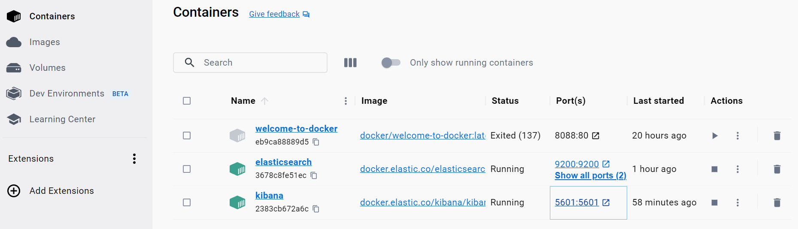
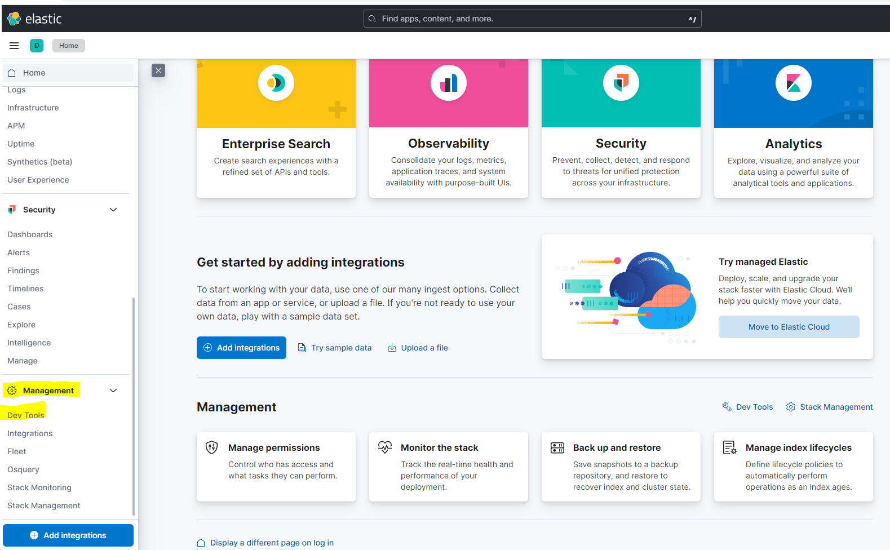
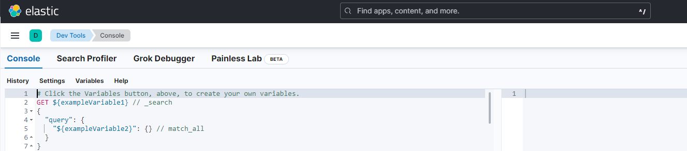

# ElasticSearch & Kibana Tutorial
A sample repository for discovering Elastic Search and Kibana

- [Install Docker Deckstop](https://docs.docker.com/desktop/)
 
- [Install Guide Elastic Search](https://github.com/elastic/elasticsearch)
 
- Download the official Docker Images of Elastic Search and Kibana (here the 8.7.1 version) , then launch the containers :
 
```shell
docker network create elastic
docker pull docker.elastic.co/elasticsearch/elasticsearch:8.7.1 (1)
docker run --name elasticsearch --net elastic -p 9200:9200 -p 9300:9300 -e "discovery.type=single-node" -t docker.elastic.co/elasticsearch/elasticsearch:8.7.1
```
```shell
docker pull docker.elastic.co/kibana/kibana:8.7.1
docker run --name kibana --net elastic -p 5601:5601 docker.elastic.co/kibana/kibana:8.7.1
 ```
 - Check that the ports 5601 and 9200 are listening with `netstat` or `curl` :
 ```shell
 curl localhost:5601
 ```


 - You should see the following message in the console, paste it somewhere safe:
 ```
✅ Elasticsearch security features have been automatically configured!
✅ Authentication is enabled and cluster connections are encrypted.

ℹ️  Password for the elastic user (reset with `bin/elasticsearch-reset-password -u elastic`):

ℹ️  HTTP CA certificate SHA-256 fingerprint:

ℹ️  Configure Kibana to use this cluster:
• Run Kibana and click the configuration link in the terminal when Kibana starts.
• Copy the following enrollment token and paste it into Kibana in your browser (valid for the next 30 minutes):  

ℹ️ Configure other nodes to join this cluster:
• Copy the following enrollment token and start new Elasticsearch nodes with `bin/elasticsearch --enrollment-token <token>` (valid for the next 30 minutes):
  
  If you're running in Docker, copy the enrollment token and run:
  `docker run -e "ENROLLMENT_TOKEN=<token>" docker.elastic.co/elasticsearch/elasticsearch:8.7.1`
 ```
 
 - Log in to [Kibana]( http://0.0.0.0:5601/) as the `elastic` user with the password that was generated when you started Elasticsearch
 
 - Search for Kibana's Developer Console in **Management > Dev Tools** :
 
 
 
 - You should see something like that:
 
 

- Off the Elastic Search hole you go !

| Exercice      | Topic          | Difficulty  |
| ------------- |:-------------:| -----:|
| 1    | [CRUD Operations](Exo1_CRUD.md) | :star: |
| 2     | [Basic Queries](Exo2_Query.md)   |  :star: |
| 3 |[Boolean Queries](Exo3_BoolQueries.md)     |   :star::star: |
